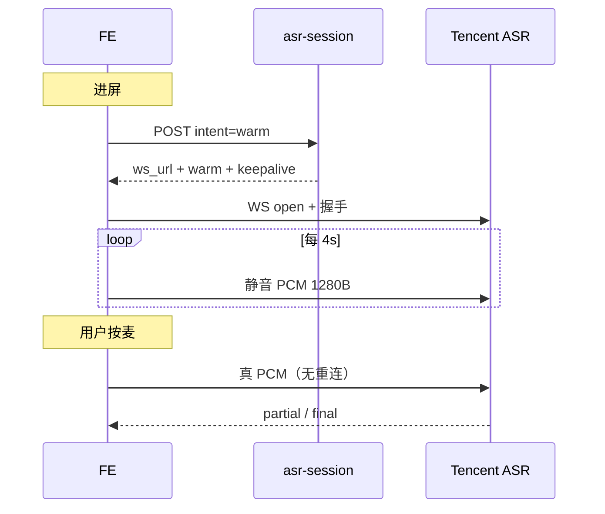

# ASR 连接预热 · §3 契约（给 Code）

> **前置**: §1 de-risk 已通过 → **路线 A**（`max_idle_s=60`），见 `docs/BE_asr-warm_§1_de-risk_结论.md`  
> **BE v1.2**（2026-06-06）：`intent:"warm"` 不再 400；响应新增 `warm` 块  
> **分工**: BE 签发 + 参数；FE 进屏预连 WS / 切后台拆连 / 过期重热 / 无感回退

---

## 0. 架构（生产 direct）



- **凭证预取**（`prefetch`）：只缓存 HTTP 响应，**不**开 WS。
- **连接预热**（`warm`）：签 URL 后 FE **立即** open `ws_url`，按 `keepalive` 发静音 PCM。

---

## 1. 请求：`intent:"warm"`

```json
POST /functions/v1/asr-session
{
  "sample_rate": 16000,
  "format": "pcm",
  "intent": "warm"
}
```

| `intent` | 用途 | 400? |
|---|---|---|
| `prefetch` | 进屏 HTTP 预取凭证 | 否 |
| `warm` | 进屏 WS 预热（签 URL + 埋点） | **否** |
| `record` | 按麦当场签（或无 intent） | 否 |
| `live` | 兼容别名 → `record` | 否 |
| 其它 | — | **400** |

- **不计日配额**（与 prefetch 相同）
- **不影响签名**（与 prefetch 相同 URL 参数）

---

## 2. 响应字段（v1.2 新增 `warm`）

```json
{
  "ws_url": "wss://asr.cloud.tencent.com/asr/v2/…",
  "session_id": "…",
  "expires_at": 1717334400000,
  "cacheable_until": 1717334370000,
  "cache_buffer_ms": 30000,
  "ttl_seconds": 300,
  "keepalive": {
    "max_audio_gap_ms": 6000,
    "pcm_chunk_duration_ms": 40,
    "silent_pcm_interval_ms": 4000,
    "relay_ws_ping_ms": 25000
  },
  "warm": {
    "max_idle_s": 60,
    "reconnect_on_drop": true,
    "route": "A"
  }
}
```

| 字段 | 含义 |
|---|---|
| `session_id` | 热连接句柄；连上后调 `/asr-usage`（与现网相同） |
| `expires_at` | 预签名 URL 绝对过期（ms）；须在此前 open WS |
| `cacheable_until` | HTTP 缓存复用截止 = `expires_at − 30000` |
| `warm.max_idle_s` | 静音 keepalive 可养上限 **60s**（§1 实测） |
| `warm.reconnect_on_drop` | WS 断 → 重签 + 重连；失败则冷连回退 |
| `warm.route` | 固定 `"A"`；若为 `"B"` 则只做 DNS/TLS（见 §4） |

### 寿命与重热

| 事件 | FE 行为 |
|---|---|
| `now >= cacheable_until` | 丢弃 HTTP 缓存，重新 `intent:"warm"` |
| idle > `warm.max_idle_s` | 主动关 WS 并重热，或按麦前重热 |
| WS 断开 / 腾讯 error | 透明重连 1 次；仍失败 → **冷连回退**（§3） |
| 切后台 | 关 WS，回前台再 `warm` |

BE **不**持有 FE 的 WS；重热 = 新 `POST /asr-session` + 新 `session_id`。

---

## 3. 无感回退（必须）

热连接不可用（重热失败、429 配额在 `/asr-usage`、网络错误）时：

1. **不得**阻塞按麦 — 走现有冷路径：`POST asr-session`（无 warm）→ open WS → 录音。
2. 用户只看到正常「连接中」，**不**弹「预热失败」。
3. 埋点区分 `warmHit` / `warmMiss` / `coldFallback` 即可。

---

## 4. 路线 B · 只热 DNS/TLS（退路）

§1 未通过时才启用。当前 **route=A**，本节备查。

| 项 | 值 |
|---|---|
| 主机 | `asr.cloud.tencent.com` |
| 端口 | 443 (WSS) |
| 触发 | 进屏对 `wss://asr.cloud.tencent.com/` 做一次 TLS 握手（不必完成 ASR 协议） |
| ASR WS | 仍在按麦时开完整会话 |

Android 可用 `Cronet` / `OkHttp` 预连接；iOS 可用 `NWConnection`。BE 无额外端点。

---

## 5. Relay 模式（volcano，当前生产关闭）

`VOLCANO_ASR_ENABLED=false` 时 **不适用**。

若将来启用 relay：FE warm 连 `ws_url`（relay）时，relay **已在 client WS open 时建 upstream**（`asr-relay/index.ts`）。FE 仍须发静音 PCM 养近端；relay 侧 25s ping 养 upstream。上游断 → relay 透明重连（待 volcano 再开时补全）。

---

## 6. 测量口径（§5）

脚本：`supabase/tests/asr_warm_latency.py`

| 路径 | 起点 | 终点 |
|---|---|---|
| **冷** | 按麦（含 WS connect + 握手） | 首个 partial |
| **热** | WS 已连 + 15s idle 后，按麦首帧 PCM | 首个 partial |

**2026-06-06 生产 2 次跑分**（`asr-warm-latency-20260606T110113Z.json`）：

| 路径 | 按麦→首 partial（median） |
|---|---|
| 冷 | **8532 ms**（connect ~280ms + 识别 ~8250ms） |
| 热 | **6599 ms** |
| **Δ** | **~1933 ms（≈1.9s）** |

进屏预连消除的是 **DNS+TLS+WS 握手（~250ms）** 以及 ASR 会话已就绪带来的识别侧增益；主要体感在首 partial 提前 ~2s。

---

## 7. FE checklist

- [ ] 进屏：`intent:"warm"` → open WS → 4s 静音 keepalive
- [ ] 按麦：停 keepalive timer，直接送 Mic PCM
- [ ] `now >= cacheable_until` 或 idle > 60s → 重热
- [ ] 热失败 → 冷连回退，用户无感
- [ ] 切后台：关 WS；回前台重 warm
- [ ] 读 `warm.route`；若为 `B` 改 DNS/TLS 策略

---

## 相关文档

- §1 结论：`docs/BE_asr-warm_§1_de-risk_结论.md`
- 防断 v1.1：`docs/BE_asr-session_提速防断_给Code.md`
- 锁定契约：`docs/asr-session-contract.md`
