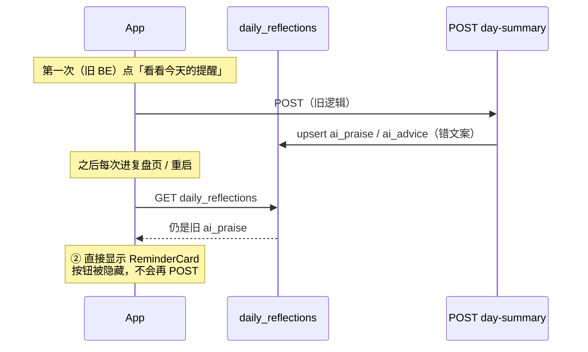

# day-summary v2 · 真机怎么测（为什么重启还是旧文案）

> **结论**：不是 BE 没部署，也不是 App 本地缓存。**旧文案已 upsert 进 Supabase `daily_reflections`**，进屏 `load()` 直接回读，**不会自动再调** `POST /day-summary`。

---

## 为什么重启 App 还是旧的？



FE 逻辑（`ReviewViewModel.load`）：

- 有 `ai_praise` / `ai_advice` → **直接展示**，不请求新 summary  
- `hasReminder == true` 时 **「看看今天的提醒」按钮不出现** → 无法在 App 内重生成  

所以：**重启只重新 GET 同一条 DB 记录**，不会触发 BE v2.1 重算。

---

## 正确复测步骤（推荐）

### 1. 先看清 DB 里存的是什么

用 **App 登录同一账号** 的 `access_token`（或 Supabase Dashboard → Authentication → 该用户 → 复制 JWT）：

```bash
export SUPABASE_URL="https://mpxdworxojotiwjxdeds.supabase.co"
export SUPABASE_ANON_KEY="<anon>"
export ACCESS_TOKEN="<你的 access_token>"

bash supabase/tests/day_summary_retest.sh
```

脚本会：

1. 打印当前 `ai_praise` / `ai_advice`（= App 看到的）  
2. 打印 DB `tasks` 并算期望 **done/total**  
3. **PATCH 清空** 当天 `ai_*`  
4. **POST /day-summary**（只带 `date`，统计以 DB 为准）  
5. 再 GET 验证持久化  

### 2. 再在 App 验证

1. **完全杀进程**（不是切后台）  
2. 进复盘页 → 应显示脚本写入的新 `ai_praise` / `ai_advice`  
3. 对照 ① 审核列表：数字应为 **3/5**（或你当天真实 done/total），advice 只提真实任务（如「休息一下」），**无「深度活儿」**

### 3. 仅验 API（不经过 App）

```bash
curl -s -X POST "$SUPABASE_URL/functions/v1/day-summary" \
  -H "apikey: $SUPABASE_ANON_KEY" \
  -H "Authorization: Bearer $ACCESS_TOKEN" \
  -H "Content-Type: application/json" \
  -d "{\"date\":\"$(date +%Y-%m-%d)\"}" | jq '{praise, advice}'
```

---

## 验收对照表

| 检查项 | 通过标准 |
|---|---|
| 数字 | praise 含 `5件里做成了3件`（与 DB tasks 一致，非 2/1） |
| praise 点名 | 含健身 / 写文档 / 陪客户吃饭等 **done** 标题 |
| advice | 只引用今日列表任务；无「深度活儿」除非真有该任务 |
| 持久化 | GET `daily_reflections` 与 POST 响应一致 |
| App | 清 ai_* 后 POST → 杀进程重进 → 显示新文案 |

---

## 给 Code 的后续（非本次 BE 范围）

真机长期体验建议（可选）：

1. **审核变更后**：tasks PATCH/apply 成功 → 清空本地 praise/advice 或自动 `generateReminder()`  
2. **ReminderCard 上「重新生成」**：已有文案时也能再 POST（耗配额但可测/可刷新）  
3. **load 时**：若 `ai_praise` 含旧禁忌句式 → 视为 stale，不展示、显示按钮  

当前要验 BE：**必须先清 DB 或走 retest 脚本**，单靠重启不够。

---

## 相关

- BE v2.1 修复：`docs/test-evidence/day-summary-v2-fix-2026-06-07.md`  
- 单测：`deno test supabase/functions/_shared/review/day_summary_v2_test.ts`
